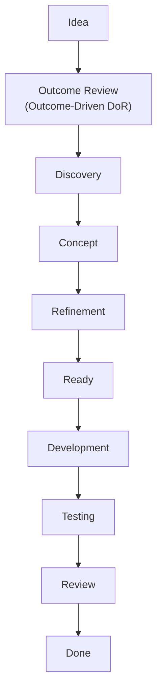

# Outcome-Driven Definition of Ready (OD-DoR)

## Core Principle

> Customers do not buy features.
> Customers buy outcomes.

Before building anything, we must be able to answer:

1. What problem are we solving?
2. What does the problem cost today?
3. What does success look like?
4. Why is this the right solution?
5. Why is this the shortest path to success?

If these questions cannot be answered, the item is **not Ready**.

---

# Product Level Definition of Ready

A Product Idea is considered ready for Discovery when all criteria are fulfilled.

## 1. Customer Problem Identified

### Checklist

- [ ] Target customer group identified
- [ ] Customer problem described
- [ ] Problem validated through evidence
- [ ] Current alternatives documented
- [ ] Urgency understood

### Review Questions

- Who experiences this problem?
- How often does it occur?
- What happens if nothing changes?
- How is the problem solved today?

---

## 2. Business Impact Quantified

### Checklist

- [ ] Problem has measurable cost
- [ ] Cost estimate documented
- [ ] Impact assumptions documented

### Review Questions

- What does this problem cost today?
- How much time is wasted?
- How much revenue is lost?
- What risks are created?

### Example

| Metric | Current |
|----------|----------|
| Processing Time | 45 min |
| Monthly Requests | 1,200 |
| Cost per Request | €18 |
| Monthly Cost | €21,600 |

---

## 3. Success Defined

### Checklist

- [ ] Success metrics defined
- [ ] Baseline established
- [ ] Target values defined
- [ ] Measurement method known

### Review Questions

- How do we know we succeeded?
- What metric changes?
- What target must be reached?

### Example

| Metric | Current | Target |
|----------|----------|----------|
| Processing Time | 45 min | 10 min |
| Error Rate | 12% | <2% |
| Customer Satisfaction | 3.4 | >4.5 |

---

## 4. Desired Outcome Documented

### Checklist

- [ ] Desired business outcome defined
- [ ] Desired customer outcome defined
- [ ] Outcome independent from implementation

### Good Example

> Reduce invoice processing time by 75%.

### Bad Example

> Build an AI invoice workflow.

---

## 5. Execution Strategy Identified

### Checklist

- [ ] Multiple solution options considered
- [ ] Risks identified
- [ ] Assumptions documented
- [ ] Simplest viable approach selected

### Review Questions

- Why this solution?
- What alternatives exist?
- Is there a simpler approach?

---

## Product Ready Gate

A Product is Ready when:

- [ ] Problem is known
- [ ] Cost is known
- [ ] Success is measurable
- [ ] Outcome is defined
- [ ] Simplest path identified

---

# Feature Level Definition of Ready

A Feature is Ready for Refinement when all criteria are fulfilled.

---

## 1. Feature Supports a Product Outcome

### Checklist

- [ ] Feature linked to Product Goal
- [ ] Feature linked to Business Outcome
- [ ] Feature linked to Customer Outcome

### Review Questions

- Which product goal does this support?
- What happens if we do not build it?

---

## 2. Problem Statement Exists

### Template

```text
Current Situation:
...

Problem:
...

Impact:
...

Affected Users:
...
```

### Checklist

- [ ] Problem documented
- [ ] Impact documented
- [ ] Users identified

---

## 3. Success Criteria Defined

### Checklist

- [ ] Feature metrics defined
- [ ] Baseline known
- [ ] Target known

### Example

```text
Current completion rate: 52%
Target completion rate: 80%
```

---

## 4. Value Hypothesis Defined

### Template

```text
We believe that

[Feature]

for

[User]

will improve

[Metric]

from

[Current State]

to

[Target State].
```

### Example

```text
We believe that
automatic invoice extraction

for
accounting teams

will reduce processing time

from
45 minutes

to
10 minutes.
```

---

## 5. Simplest Deliverable Identified

### Checklist

- [ ] MVP defined
- [ ] Nice-to-haves removed
- [ ] Scope minimized

### Review Questions

- What is the smallest thing that proves value?
- What can be removed?

---

## Feature Ready Gate

A Feature is Ready when:

- [ ] Problem exists
- [ ] Outcome exists
- [ ] Success measurable
- [ ] Value hypothesis exists
- [ ] Smallest viable scope identified

---

# Product Manager Daily Review Checklist

Before accepting any new Product Idea or Feature:

## Problem

- [ ] Do I know who has the problem?
- [ ] Do I know what the problem costs?
- [ ] Do I have evidence?

## Outcome

- [ ] Do I know what success looks like?
- [ ] Is success measurable?
- [ ] Is there a baseline?

## Value

- [ ] Why should anyone care?
- [ ] What changes after implementation?
- [ ] Is value larger than implementation effort?

## Scope

- [ ] Is this the smallest useful version?
- [ ] What can be removed?
- [ ] What assumptions remain?

## Decision

- [ ] Ready for Discovery
- [ ] Needs Research
- [ ] Needs Refinement
- [ ] Reject
- [ ] Defer

---

## Golden Rule

If you cannot answer:

1. What problem are we solving?
2. What does it cost today?
3. How do we measure success?
4. What is the smallest path to success?

then the item is **not Ready**.

## Product and Feature Lifecycle


